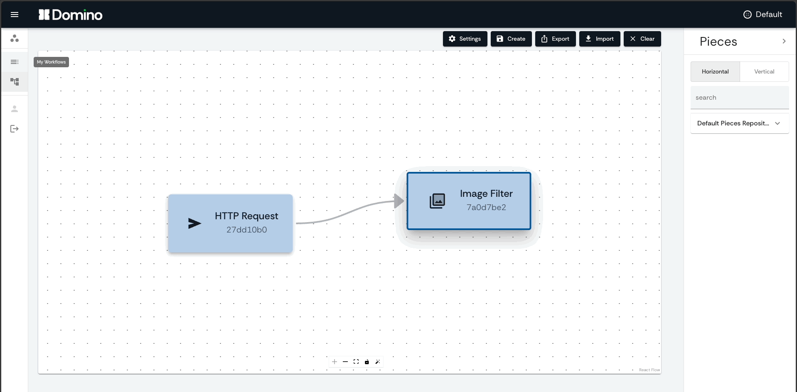

import { Icon } from '@iconify/react'

:::note **TL-DR:**
Domino is a groundbreaking open-source platform dedicated to visually creating and managing data and AI workflows. With its intuitive drag-and-drop graphical interface, anyone can effortlessly construct complex workflows by piecing together cutting-edge modular operations, no coding required! Additionally, Domino gives developers the power to bundle their Python functions into self-containing, reusable, shareable modules, promoting a culture of collaboration, efficiency and reproducibility.
:::

<!--truncate-->

## Introduction to Domino (for non-devs)
The world of data and artificial intelligence is continuously evolving at a rapid pace, which can be overwhelming to non-technical individuals to follow. Technologies such as containers and code repositories have certainly democratized these advancements, making them more accessible than ever. Yet, harnessing advanced algorithms from disparate sources to create tailor-made solutions for specific use cases still requires significant coding expertise. Domino comes to change that.

Domino brings an intuitive graphical interface, designed to simplify the process of building and managing complex data and AI workflows. It is as easy as playing with toy blocks! You can literally drag and drop 'Pieces', as we call them in Domino language, to construct intricate workflows, all without writing a single line of code. No more intimidation by complex coding environments or the need for a deep understanding of programming languages. Domino puts the power of data and AI into your hands, regardless of your technical background.

The modular nature of Pieces allows you to take advantage of complex data and AI operations that have been pre-packaged by experts. Imagine being able to harness the power of advanced algorithms, state-of-the-art machine learning models, or sophisticated data transformation processes, all readily available for you to plug into your workflows. The power of Python functions are now accessible to you in a visual, interactive, and intuitive way.

And it doesn't stop there. Domino's GUI-first approach doesn't just simplify the creation of workflows. It also provides an intuitive supervision experience, allowing you to visually monitor and manage your workflows in real-time. It's like having a dashboard for your data and AI operations, giving you complete visibility and control over your workflows.

If you are a non-technical individual working in a domain that could benefit from leveraging data and AI, Domino is for you. It breaks down the barriers to entry into the world of data and AI, allowing you to implement your ideas effectively and efficiently. With Domino, you don't just consume technology - you create with it.

## Introduction to Domino (for devs)
Ever had that euphoric moment when you've just successfully completed a complex data workflow project? After many hours spent crafting functions, meticulously documenting them, ensuring robust error handling, and striving for efficiency, you can finally take a breather and enjoy the satisfaction of your accomplishment. But in the aftermath, you may find yourself pondering:

> "If only I could encapsulate these functions as neat modules on my screen, then just drag and drop them whenever I want to use them in future..."

If you've worked with data science, machine learning or a related field, this scenario is likely a familiar one. Well, guess what? Now you can! Domino offers the capability to transform any Python code into modular Pieces that can be seamlessly arranged within an intuitive graphical interface to create powerful  data workflows.

Domino’s innovative approach not only boosts the efficiency of the workflow creation process, but also encourages a collaborative environment. You can package your well-crafted Python functions into a Piece, complete with its unique data model and isolated execution environment, and share it across your organization, or even beyond. Over time, your colleagues and peers can assemble a rich and diverse toolbox of Pieces, each embodying the expertise of different teams, ready to be pieced together in any number of ways.

The underlying design of Domino places a strong emphasis on promoting best practices in open-source code sharing. By creating a standard for creating Pieces - reusable modules of Python functions - it encourages you to think modularly, breaking down complex workflows into simple, manageable components. Each Piece is designed to be self-contained, bundled as a container, ensuring not only its portability across systems but also its consistent execution.

A core element of Domino's standard is a well-defined data model for each Piece, which clearly outlines the inputs required and outputs generated. This fosters transparency and understanding among users, making it easier to incorporate into existing or new workflows. It's also a boon for documentation, as each Piece can come with detailed notes explaining its purpose, the function it carries out, and the data it works with.

Furthermore, the Pieces you create can be shared within your organization or published in an open-source repository, inviting contributions and usage from the wider developer community. This approach not only accelerates the spread of innovative solutions and ideas but also enhances the collaborative spirit that is at the heart of open-source culture.

Domino provides an optimal framework for developers to adhere to best practices of open source code sharing, promoting modular programming and informative documentation. Domino lets you focus on what you do best: writing effective and efficient code to solve complex problems. It takes care of the orchestration, execution, and scalability, and provides a platform for your work to be leveraged and appreciated by others.

## What does Domino do?
At its core, Domino operates as an application on top of Apache Airflow. Domino aims at drastically enhancing the user experience in creating, editing, and monitoring workflows, while still relying on Airflow’s powerful workflow orchestration capabilities. Domino brings the Airflow experience to a whole new level with:

- A GUI-first approach in the creation of data and AI workflows
- Intuitive and rich workflows supervision panels
- The ability to create and distribute plug-and-play modular Pieces

Let's dive deeper into each of these exciting features.

### GUI-first creation of workflows
The journey of creating workflows in Airflow can begin quite straightforwardly, but as the complexity scales up, the task can quickly become intimidating. This is where Domino shines, replacing script-writing with an interactive graphical interface that allows you to build and edit workflows with simple drag-and-drop operations.

On top of that, Domino transcends the language barrier imposed by Airflow's Python-writing requirement, thereby empowering even non-developers to tailor data pipelines. Pieces in Domino are interactive nodes that let you manually enter input data and connect output data variables from upstream tasks to input data variables of downstream tasks.

Domino’s graphical interface brings a breath of fresh air to workflows creation, reducing complex coding processes to simple clicks!

### Intuitive workflows supervision
Tired of scourging through a cluttered Airflow UI to find simple information about your dag runs? Domino brings a more streamlined UI experience, with the rich information from Airflow's UI, only better organized and easier to navigate. In fact, Domino goes beyond and provides a richer interface for visual inspection of task-level results.

### Creation and distribution of plug-and-play modular Pieces
Perhaps the most game-changing feature of Domino is its standard for the creation of reusable, modular Pieces. Each Piece is defined by its function and data models, and ships in its isolated and self-contained execution environment, ensuring that dependencies are satisfied and the operations will run safely and consistently upon deployment.

We've reimagined how Airflow tasks are written, adding a layer of abstraction with the help of Pydantic models, Containers, and the KubernetesPodOperator. This modular approach allows you to create atomic components which can be easily configured and shared. The result? Highly reusable and distributable code that others can seamlessly incorporate into their own workflows!

## Who can benefit from Domino?
At its heart, Domino is an enabler; it seeks to empower individuals who work with data and AI workflows in any capacity. If you've been yearning for a visual tool for crafting and modifying your workflows, or looking for a streamlined and intuitive way to navigate through your workflows tasks, Domino is just the ticket for you. This innovative tool puts the power of sharing and reusing workflow components at your fingertips, and enables you to grant your clients a degree of autonomy and involvement over the workflows you manage.

Domino transcends the boundaries of technical expertise. Regardless of your role - whether you are an infrastructure specialist, a contributing developer, a data science enthusiast, or a business professional, Domino has resources and tools tailored for your needs. The platform is designed to nurture creativity and collaboration, facilitating the design and supervision of sophisticated data workflows. With Domino transformative approach, you’ll be empowered to explore the full potential of cutting-edge methods in machine learning and data science.

## Why is Domino a Game-Changer?
Here's the real magic of Domino: unlike commercial pipeline builders that limit data processing steps to what their internal software team can develop, Domino encourages the open source community to contribute and share repositories of reusable code. We hope this will allow for a rapid expansion of Pieces within the ecosystem, leveraging the vast array of tools available to the open source community.

Being Kubernetes native, Domino fully supports containerized Operators, allowing functions to ship together with their dependencies. This means they are immutable, ready-to-run, and will operate in an isolated environment, guaranteeing consistency and reproducibility of workflows.

In summary, Domino is a groundbreaking open source, intuitive GUI workflows platform that promotes the creation, distribution, and reuse of modular workflow components. Our aim is to democratize access to complex workflows, and enable anyone to create and manage them with ease. And we are just getting started. Join us in this exciting journey, and contribute to shaping the future of data and AI workflows with Domino. Try it out today!

<a
    href="https://github.com/Tauffer-Consulting/domino"
    style={{
        display: 'flex',
        alignItems: 'center',
        textDecoration: 'none',
        fontSize: '16px',
        textDecoration: 'none',
        marginBottom: '10px'
    }}
>
    <Icon icon="mdi:github" width="40" style={{ marginRight: '10px' }} />
    Domino on GitHub
</a>

<a
    href="https://domino-workflows.io/docs/intro"
    style={{
        display: 'flex',
        alignItems: 'center',
        textDecoration: 'none',
        fontSize: '16px',
        textDecoration: 'none',
        marginBottom: '10px'
    }}
>
    <Icon icon="iconoir:google-docs" width="40" style={{ marginRight: '10px' }} />
    Domino's documentation
</a>

 

> Do you want to incorporate Domino as a visual workflow creation and supervision tool to your business operations, but lack technical personnel well versed in data workflows, Apache Airflow or Kubernetes? [Get in touch with us](https://domino-workflows.io/#contact)!

