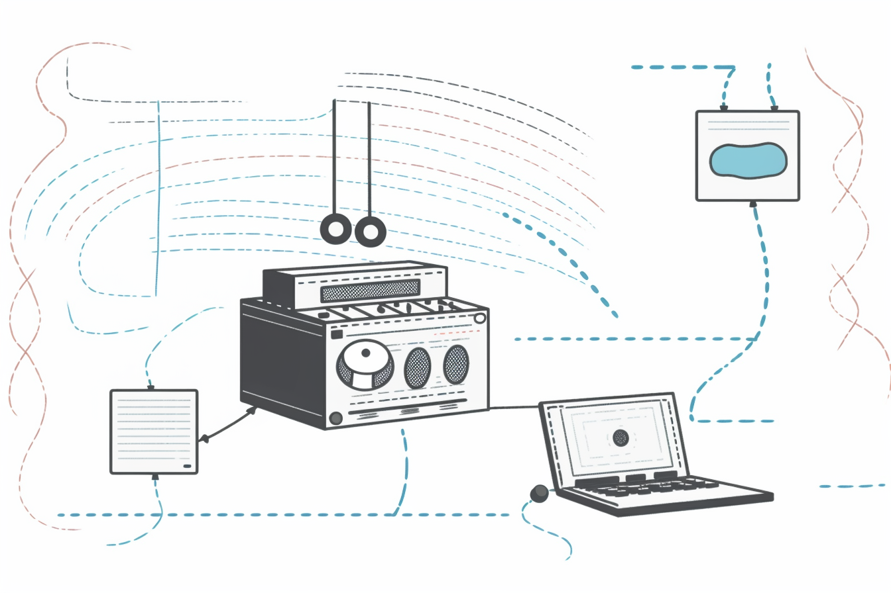

import { Icon } from '@iconify/react'

:::note **Summary**
Domino helps you build creative workflows using data and AI. In this post, we will learn how to combine Youtube, Speech Recognition models and LLMs Pieces in Domino to create your own personalized podcast digest service.
:::

<!--truncate-->

In a world saturated with information, keeping track of your diverse interests can be daunting. Take podcasts for example: the sheer volume of content produced daily can be so overwhelming that it becomes tough to filter out channels and episodes that will truly captivate you. Now, picture waking up to a personalized podcasts digest every morning, to enjoy while you savor your breakfast. Gone are the days of endless scrolling and sifting through episodes, instead, you're greeted with a tailored digest ready to assist in selecting the perfect episode to start your day.

That's what we'll build today with Domino!

## Building a podcast digest workflow
Domino allows you to combine a wide variety of data processing algorithms to build your own customized solutions. To create a podcast digest workflow with Domino, we can use the following Pieces:

- **YouTube List Videos**: Retrieves a list of available videos from a designated YouTube channel.
- **Get Item From Array**: Extracts the one item from a list. In this case, we’ll get the most recent video.
- **YouTube Download Piece**: Downloads the YouTube video as an MP3 file.
- **OpenAI Audio Transcript**: Transcribes audio to text using the OpenAI API.
- (alternatively) **Audio Transcription Local**: Transcribes audio to text using a local open speech-to-text model.
- **Text Summarizer**: Condenses the transcription into a concise and informative summary, utilizing the OpenAI API.
- (alternatively) **Text Summarizer Local**: Condenses the transcription into a concise and informative summary, using a local open Large Language Model (LLM).
- **Email Sender**: Sends the resulting podcast summary to a specified list of email addresses.

Some of these Pieces might not come installed by default in your Domino workspace. If that's the case, you can install them by following the steps described in the [**Install Pieces repositories**](../settings/installing_repositories) session.

Check out our tutorial video showing how to create this workflow, using the OpenAI API service:

<iframe width="100%" height="315" src="https://www.youtube.com/embed/u7S3LrrRe7A?si=cP5VZ4aova4c7Qpn" title="YouTube video player" frameborder="0" allow="accelerometer; autoplay; clipboard-write; encrypted-media; gyroscope; picture-in-picture; web-share" allowfullscreen></iframe>

## Using local algorithms
Unlike other workflow management platforms, Domino is more than just an API connector. Domino's pieces can handle various types of processing, ranging from light tasks such as API requests to more compute intensive tasks such as local artificial intelligence models. The resource allocation for each piece can be defined in the workflow creation through the Advanced Options tab in the piece's form.

The capability to provision local (non-API) data processing is crucial for many applications, and essential for companies prioritizing critical aspects such as data security, cost efficiency, the ability to implement custom code, including custom machine learning models, and overall a more fine-grained control over their workflows.

- **Data Security**: By utilizing local algorithms, businesses can confidently retain their data within their infrastructure, eliminating the risk of exposing sensitive information with external APIs.
- **Custom Solutions**: Imagine your data science team has developed a proprietary machine learning model tailored precisely to your business problem, and its privacy is paramount. With Domino’s pieces development framework it is easy to encapsulate this model as a Piece to be used by anyone on your team through Domino's UI. This allows organizations to leverage their specialized solutions securely, guaranteeing that any proprietary solutions can be utilized efficiently within Domino's platform.
- **Control over Operations**: Being an open-source solution, Domino offers the advantage of being self-hostable on your internal infrastructure. This ensures that you retain complete ownership and control over your data, code and workflows. This level of independence is invaluable, especially for entities operating under stringent regulatory frameworks or internal policies.
- **Cost-Efficiency**: In certain circumstances, running algorithms locally can be more economical and faster than relying on external servers. This is the case, for example, when companies have idle computing capacity ready to be used.

We can illustrate how seamless it is to switch between external API services to local algorithms, using the same podcast digest workflow. We can substitute the OpenAI Audio Transcript Piece for a local version of the [Whisper model](https://huggingface.co/openai/whisper-base) for audio transcription. Similarly, at the summarization step, we can substitute the OpenAI API service for a local [BART model](https://huggingface.co/facebook/bart-large), a popular open LLM for text summarization.

Check out our tutorial video showing how to create this workflow, using the open LLMs:

<iframe width="100%" height="315" src="https://www.youtube.com/embed/10HjaaO35Mk?si=r4A4-tf6jXU5gfjV" title="YouTube video player" frameborder="0" allow="accelerometer; autoplay; clipboard-write; encrypted-media; gyroscope; picture-in-picture; web-share" allowfullscreen></iframe>

## Conclusion
Domino’s adaptability empowers users to tailor their workflow creation process according to their specific preferences and requirements, mix-and-matching external API services with internal code as needed. Domino has an open model for production of Pieces, which encourages distribution and collaboration. Find the Pieces used in this example and many others in the [**Pieces Gallery**](../gallery).

Domino workflows, no matter how complex, are reusable: easy to import, export and share. You can also import these and other example workflows directly from the workflows gallery, in the Workflow Editor. See how in our [**Quickstart**](../quickstart) guide.

Try Domino out today!

<a
    href="https://github.com/Tauffer-Consulting/domino"
    style={{
        display: 'flex',
        alignItems: 'center',
        textDecoration: 'none',
        fontSize: '16px',
        textDecoration: 'none',
        marginBottom: '10px'
    }}
>
    <Icon icon="mdi:github" width="40" style={{ marginRight: '10px' }} />
    Domino source code on GitHub
</a>

<a
    href="https://docs.domino-workflows.io"
    style={{
        display: 'flex',
        alignItems: 'center',
        textDecoration: 'none',
        fontSize: '16px',
        textDecoration: 'none',
        marginBottom: '10px'
    }}
>
    <Icon icon="iconoir:google-docs" width="40" style={{ marginRight: '10px' }} />
    Documentation
</a>

 

> Do you want to incorporate Domino as a visual workflow creation and supervision tool to your business operations, but lack technical personnel well versed in data workflows, Apache Airflow or Kubernetes? [Get in touch with us](https://domino-workflows.io/#contact)!